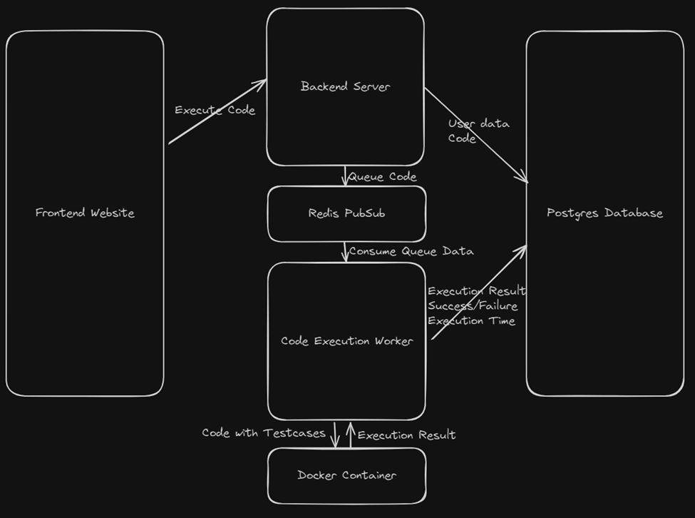

# Contributing to the Project

## How can I contribute?

Here are some ways you can contribute to the project:

- **Report Bugs**: If you find a bug, please report it on the issue tracker. Include as much detail as possible to help us reproduce the issue.
- **Suggest Features**: If you have an idea for a new feature or improvement, please share it with us. We love hearing from our users!
- **Submit Pull Requests**: If you want to contribute code, please fork the repository and submit a pull request. Make sure to follow the coding style and include tests for your changes.
- **Documentation**: Help us improve the documentation by fixing typos, adding examples, or clarifying instructions.
- **Spread the Word**: Share the project with your friends, colleagues, or on social media. The more people know about it, the better!

## Code of Conduct

We expect all contributors to follow our [Code of Conduct](CODE_OF_CONDUCT.md). Please be respectful and considerate to others in the community. We want to create a welcoming environment for everyone.

## Setting up the Development Environment

You will require Node.js, npm, and Docker installed on your system to set up the development environment. Follow these steps to get started:

- Clone the repository
- Copy the `.env.example` file to `.env` and fill in the required values in both `frontend/` and `backend/` directories.
- Run Redis
    - Run:
        ```bash
        docker run -d -p 6379:6379 redis
        ```
- Run Postgres
    - Run:
        ```bash
        docker run -d -p 5432:5432 -e POSTGRES_USER=postgres -e POSTGRES_PASSWORD=postgres -e POSTGRES_DB=onlineide postgres
        ```
- Run the backend server
    - Navigate to the `backend` directory
    - Run `npm install`
    - Run `npm run dev`
- The backend server will be running on `localhost:3000`
- Run the frontend server
    - Navigate to the `frontend` directory
    - Run `npm install`
    - Run `npm start`
- The project will be running on `localhost:5173`
- You can now start contributing to the project!

## Code Formatting

We use Prettier for code formatting with 4 tab indents. Make sure to run `prettier --write . --tab-width 4` before submitting your pull request to ensure that your code is properly formatted.

## How to Submit a Pull Request

1.  Fork the repository
2.  Create a new branch for your feature or bug fix
3.  Make your changes and commit them with a clear message
4.  Push your changes to your forked repository
5.  Open a pull request against the main repository
6.  Make sure to include a description of your changes and any relevant issue numbers
7.  Wait for feedback from the maintainers
8.  Address any comments or suggestions
9.  Once approved, your pull request will be merged into the main repository
10. Congratulations! You've contributed to the project!

## Project Structure

The project is divided into three main directories: `frontend`, `backend` and `code-runner`. Each directory contains its own set of files and folders for the respective parts of the application.

- `frontend`: Contains the React.js frontend code, including components, styles, and assets.
- `backend`: Contains the Express.js backend code, including API routes, database models, and business logic.
- `code-runner`: Contains the code execution worker, which is responsible for running user-submitted code in a secure environment.

## How it works


