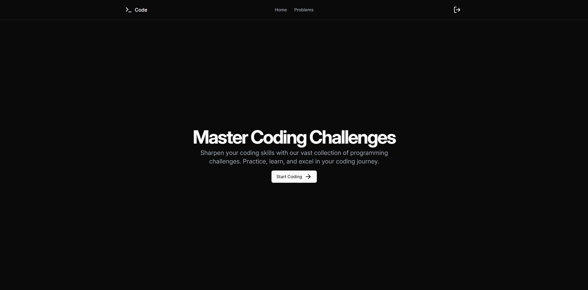
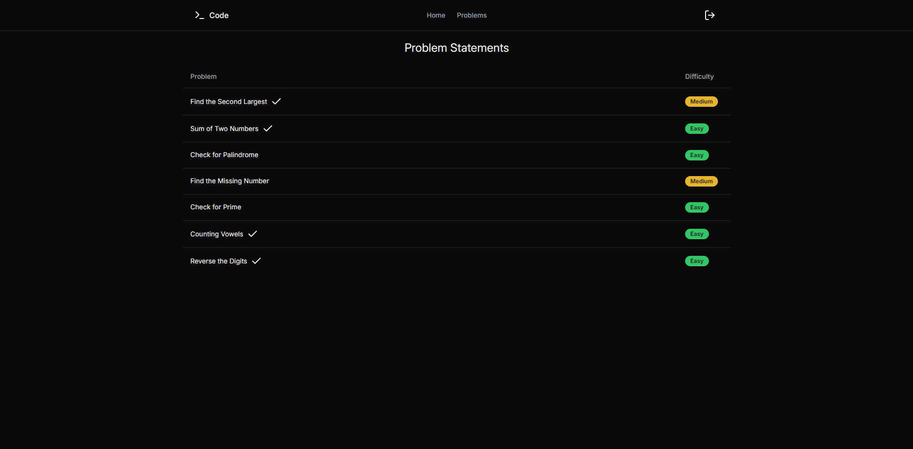

# Online IDE

Online IDE, built using Express.js and React.js

## Features

-   JWT Based User Authentication
    -   Register
    -   Login
    -   Email token verification
    -   Forgot password with OTP
-   Code Editor
    -   Syntax Highlighting
    -   4 Languages Supported (Python, C, C++, Java)
    -   Problem Statements rendered as Markdown, with support for code blocks
    -   Sample Test Cases for each problem with expected output
-   Sandboxed Code Execution
    -   Docker container for each code execution
    -   Limit time used by code
-   Verify output against hidden test cases
-   Save code to local storage

## Tech Stack

-   Express.js (Backend + Execution Worker)
-   Python (for code execution on the container)
-   React.js (Frontend)
-   Redis (for internal messaging, storing OTPs, saving code execution results)
-   PostgreSQL (with Prisma ORM)
-   Docker (with docker-compose)
-   Dockerode (for managing docker containers)
-   Resend (for sending emails)
-   Shadcn/UI (for frontend components)

## Setup

You can either use the docker-compose file to run the project or run the backend and frontend separately.

### Using Docker Compose

-   Clone the repository
-   Copy the `.env.example` file to `.env` and fill in the required values in both `frontend` and `backend` directories.
-   Run `docker compose up` in the root directory
-   The project will be running on `localhost:8000`

### Running Backend and Frontend Separately

> [!NOTE]
> You will still need to have Docker installed on your system.

-   Clone the repository
-   Copy the `.env.example` file to `.env` and fill in the required values in both `frontend` and `backend` directories.
-   Run the backend server
    -   Navigate to the `backend` directory
    -   Run `npm install`
    -   Run `npm run dev`
-   The backend server will be running on `localhost:3000`
-   Run the frontend server
    -   Navigate to the `frontend` directory
    -   Run `npm install`
    -   Run `npm start`
-   The project will be running on `localhost:5173`

## Screenshots

## Contributing

Pull requests are welcome. For major changes, please open an issue first to discuss what you would like to change.
